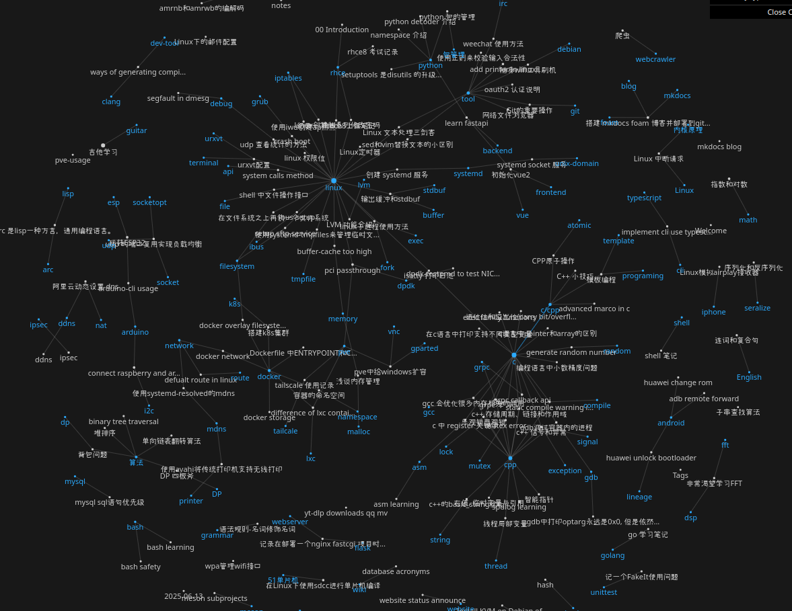

# write with mkdocs and foam

在尝试过obsidam写博客后，发现开源版的foam也非常方便，而且还可以用mkdocs来发布markdown笔记到github page，功能更完整。下面的截图是写这个笔记的情况。

## foam 优点
安装foam后还要安装它推荐的
* foam 让我可以直接贴图，然后F2来修改图片名称和路径，不需要`mv`
* foam 能查看实时脑图，方便根据关键字找文章， 还有筛选条件，算是大号的云图
* foam 支持shift拖拽插入其他markdown

## foam和mkdocs冲突
因为集成了foam和mkdocs，两个工具有冲突，需要权衡，例如标题和时间格式。总结
1. 标题使用根元素，不用metadata里的title字段当标题
2. 时间用YYYY-MM-DD 而不是 YYYY-MM-DD HH:MM:SS的格式，否则tag不生效
3. tag 只使用metadata里的tags字段

