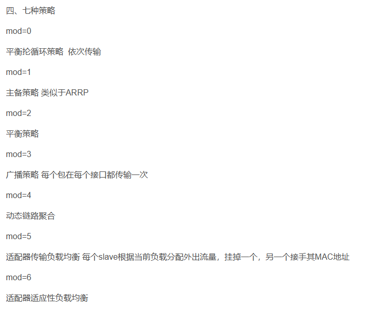

# dpdk-testpmd to test NIC speed

启动，进入dpdk 交互模式

```sh
./dpdk-testpmd -l 0-3 -n 4 --vdev=net_tap0,iface=tap0 -a 0000:07:00.0 -- -i --port-topology=chained 
./dpdk-testpmd -l 0-3 -n 4   --vdev 'net_bonding0,mode=0,member=0000:08:00.0,member=0000:09:00.0' --vdev=net_tap0,iface=tap0 -- -i --port-topology=chained

#确认
testmpd> show port summary all 

#设置转发
testpmd> set fwd io 

#启动转发
testpmd> start 
```

设置tap设备的ip
```sh
ip add add 10.9.108.211/24 dev tap0
ip route add 10.9.3.13 via 10.9.108.211 dev tap0
#启动
iperf -s
```

## dpdk bonding


要在dpdk-testpmd创建1个bond网卡，转发bond网卡和tap之间的流量。启动时要注意EAL日志，参数写错了会报错了。
```sh
# ./dpdk-testpmd -l 0-3 -n 4  --vdev=net_tap0,iface=tap0 -- -i --port-topology=chained

Configuring Port 0 (socket 0)
Port 0: D0:9F:D9:70:6E:77
Configuring Port 1 (socket 0)
Port 1: D0:9F:D9:70:6E:76
Configuring Port 2 (socket 0)
Port 2: C6:44:56:84:8C:92
Checking link statuses...
Done
```

1. 创建bond网卡，1 表示 mode, 0 是socket id。输出显示创建的bond网卡id是3
```sh
testpmd> create bonded device 1 0
Created new bonded device net_bonding_testpmd_0 on (port 3).
```

2. 打印所有网卡状态， 这里0 和1 是将被bonding的网卡，2是tap设备， 3是bond网卡。
```sh
testpmd> show port stats all
```

2. 添加slave网卡。注意建议先关掉bond网卡，再添加slave网卡。
```
testpmd> add bonding slave 0 3
testpmd> add bonding slave 1 3
```

3. 查看bond网卡配置, 如果添加slave网卡前没有停bond网卡，就会出现下面的打印，虽然Slave网卡显示有两个，但是Active的是空的。这时需要关闭再启动bond网卡。
```
testpmd> show bonding config 0
show bonding config 3
        Bonding mode: 1
        Slaves (2): [0 1]
        Active Slaves: []
        Primary: [0]
```
4. 关开bond网卡
```
testpmd> port stop 3
Stopping ports...
Done
testpmd> port start 3
Configuring Port 3 (socket 0)
```
5. 设置转发网卡id，以及启动转发。
```
testpmd> set portlist 2,3
testpmd> start
```

6. 修改Bond模式
```
set bonding mode 3 2
```


## using nmcli to create bond device

```sh
nmcli connection add type bond con-name bond0 ifname bond0 bond.options "mode=active-backup"
nmcli connection add type bond con-name bond0 ifname bond0 bond.options "mode=4"
nmcli connection add type ethernet slave-type bond con-name bond0-port1 ifname enp9s0 master bond0
nmcli connection add type ethernet slave-type bond con-name bond0-port2 ifname enp10s0 master bond0

nmcli connection modify bond0-port1 ipv4.method disabled ipv6.method disabled
nmcli connection modify bond0-port2 ipv4.method disabled ipv6.method disabled

nmcli connection modify bond0   ipv4.addresses 10.13.32.200/24 ipv4.gateway 10.13.32.1

---

nmcli connection add type bond con-name bond1 ifname bond1 bond.options "mode=active-backup"
nmcli connection add type ethernet slave-type bond con-name bond1-port1 ifname enp7s0d2 master bond1
nmcli connection add type ethernet slave-type bond con-name bond1-port2 ifname enp7s0d3 master bond1

nmcli connection modify bond1-port1 ipv4.method disabled ipv6.method disabled
nmcli connection modify bond1-port2 ipv4.method disabled ipv6.method disabled

nmcli connection modify bond1   ipv4.addresses 10.13.31.200/24 ipv4.gateway 10.13.31.1
```


HOST Machine
```sh
#Bond1 32.200
i40e 0001:08:00.0 enP1s6f0: renamed from eth0
i40e 0001:08:00.1 enP1s6f1: renamed from eth0

#Bond0  31.200
rnpm 0000:05:00.1 ens2f1d2: NIC Link is Up 10 Gbps, Flow Control: RX/TX
rnpm 0000:05:00.1 ens2f1d3: NIC Link is Up 10 Gbps, Flow Control: RX/TX
```

Virtual Machine

```sh
#bond0  31.200
rnpm 0000:05:00.0 enp5s0d2: renamed from eth2 
rnpm 0000:05:00.0 enp5s0d3: renamed from eth3

#bond1  32.200
i40e 0000:06:00.0 enp6s0: renamed from eth1
i40e 0000:07:00.0 enp7s0: renamed from eth0
```
