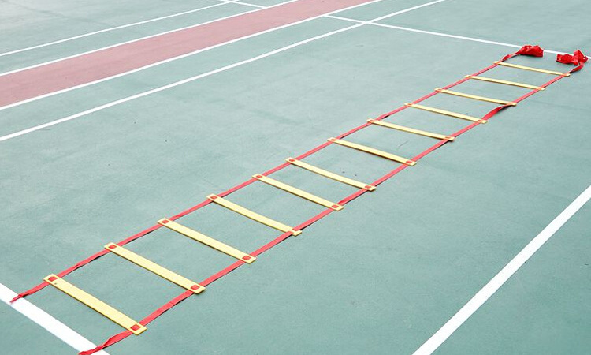

# 2024-12-09

## 儿童大富翁
所有儿童排队依次玩。摇色子决定走几步格子，一共20格。完成格子对应的挑战。

挑战：
* 学一下猫猫怎么叫
* 学一下狗狗怎么叫
* 学一下鸭子怎么叫
* 学一下公鸡怎么叫
* 学一下狼怎么叫
* 学一下电动车怎么叫
* 学一下火车怎么叫
* 学一下救护车怎么叫
* 学一下警察车怎么叫
* 加速格，学鸭子走路前进3格
* 下蹲3次
* 拍掌3次
* 单脚站3秒
* 扭屁股3次
* 加速格，学螃蟹前进3格
* 指出什么物品是红色/绿色/黄色/白色/黑色的
* 大笑3秒
* 大哭3秒
* 假装生气
* 假装伤心表情
* 大声狮子吼
* 做鬼脸
* 摇头3圈
* 转5圈走直线
* 抽问题卡
* 喊出同学的名字
* 唱一首歌

