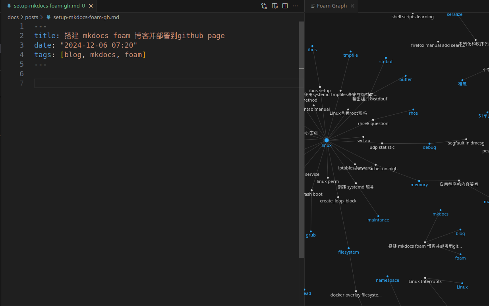

# 搭建 mkdocs foam 博客并部署到github page

在尝试过obsidam写博客后，发现开源版的foam也非常方便，而且还可以用mkdocs来发布markdown笔记到github page， 功能更完整。下面的截图是写这个笔记的情况。

## foam
安装foam后还要安装它推荐的
* foam 让我可以直接贴图，然后F2来修改图片名称和路径，不需要`mv`
* foam 能查看实时脑图，方便根据关键字找文章， 还有筛选条件，算是大号的云图
* foam 支持shift拖拽插入其他markdown

## 