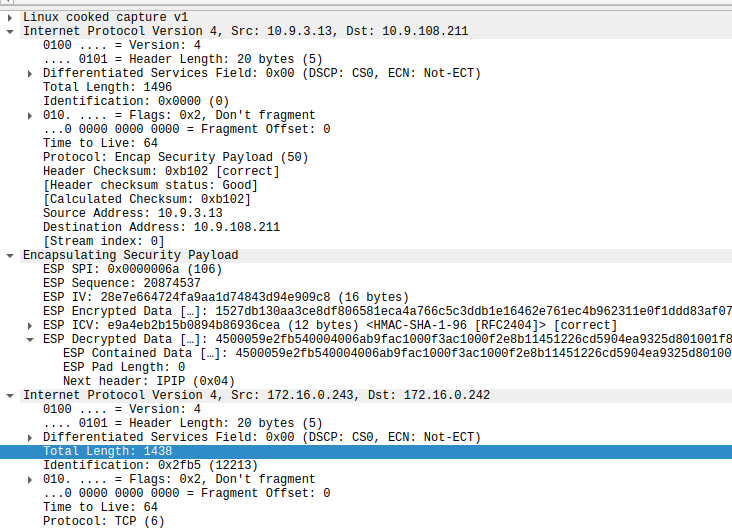

# ipsec

## tcp payload 长度计算，tunnel模式，直通不打洞
先了解ESP带来的消耗  

* 外层ip头总长度1496
* ESP SPI 字段长度4
* ESP Sequence 字段长度4
* ESP IV 长度16  AES-CBC
* ESP ICV 长度12 SHA1-96 
* ESP Pad 长度1 无padding
* ESP Next Header 长度1
  
ESP部分一共是 38，而外层ip总长度(1496) - 内层ip总长度(1438) - 外层ip头(20)= 38 byte。 外层ip头+ESP一共是58。  

所以 
1. 内层ip头最大为1500 - 58 = 1442
2. TCP MSS = 1500 - 58 - 内层ip头20 - 内层tcp/udp头20 = 1402